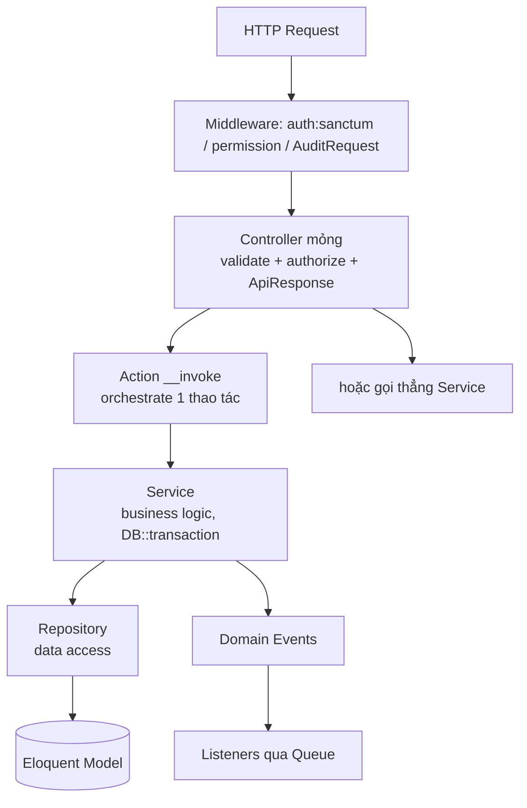

# Architecture — Backend Architecture

> Layering, convention, và các cơ chế nền của backend. Nguồn: `app/`, các module mẫu (Employee,
> Approval). Convention coding: [docs/developer-guide/engineering-standards.md](../developer-guide/engineering-standards.md).

## 1. Layering

**Quy tắc:** Controller không chứa nghiệp vụ (chỉ validate/authorize/format). Service chứa rule và
bọc trong `DB::transaction`. Repository là nơi truy cập dữ liệu (bind interface→impl qua
`RepositoryServiceProvider`). Giao tiếp chéo module qua Events.

## 2. Thành phần shared kernel (`app/`)
| Thành phần | File | Vai trò |
|---|---|---|
| ApiResponse | [Support/ApiResponse.php](../../app/Support/ApiResponse.php) | envelope `success/data/message/meta` & `error` |
| BaseModel | app/Models/BaseModel.php | base cho model module |
| HasUlid | [Concerns/HasUlid.php](../../app/Concerns/HasUlid.php) | tự sinh ULID + route key = `ulid` |
| HasAuditLog | [Concerns/HasAuditLog.php](../../app/Concerns/HasAuditLog.php) | gắn AuditObserver + `auditableFields`/`sensitiveFields` |
| Enums | app/Enums/ | WorkflowStatus, StepStatus, AuditEvent, EmploymentStatus/Type, ProvisioningStatus, PermissionScope |
| Exceptions | app/Exceptions/ | WorkflowException (errorCode+httpStatus), PermissionException, ProvisioningException |
| StateMachine | app/Support/Workflow/ | tiện ích chuyển trạng thái workflow |

## 3. Error model
`WorkflowException` mang `errorCode` (vd `WORKFLOW_PERMISSION_DENIED`) + `httpStatus` + `context`,
được `ApiResponse::error()` chuyển thành JSON `{success:false, message, code, ...context}`. Bảng mã
lỗi: [docs/api/README.md](../api/README.md#error-codes).

## 4. Audit cơ chế
Model `implements Auditable` + `use HasAuditLog` → `AuditObserver` ghi `audit_logs` khi
created/updated/deleted. `sensitiveFields` bị thay `[REDACTED]`. Middleware `AuditRequest` nạp
IP/User-Agent vào container (`audit.request.context`) để AuditService đính kèm. Bất biến: bảng chỉ
có `created_at`.

## 5. Queue & jobs
Queue tách theo loại: `default`(workflow), `notifications`, `provisioning`, `audit`. Listener chạy
async. Cron (xem [app/Console/Kernel.php](../../app/Console/Kernel.php)):
`EscalateOverdueApprovals`, `SyncContributionScores`, `SyncOrganizationGraph`, `ArchiveAuditLogs`.

## 6. Auth
Login trả Sanctum token; mọi route module dưới `auth:sanctum`. `permission:<name>` middleware kiểm
quyền (có fallback delegation). RBAC qua spatie.
