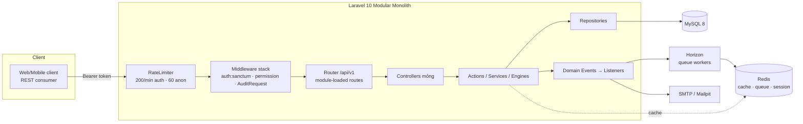

# Architecture — High Level

> Suy ra từ [config/app.php](../../config/app.php) providers, [composer.json](../../composer.json),
> [RouteServiceProvider](../../app/Providers/RouteServiceProvider.php). Xem thêm
> [module-architecture.md](module-architecture.md), [request-flow.md](request-flow.md),
> [backend-architecture.md](backend-architecture.md), [workflow-engine.md](workflow-engine.md).

## Sơ đồ tổng thể

## Thành phần
| Thành phần | Vai trò | Nguồn |
|---|---|---|
| **Sanctum** | Xác thực Bearer token (`personal_access_tokens`) | [AuthController](../../app/Http/Controllers/Auth/AuthController.php) |
| **RateLimiter `api`** | 200/phút (auth) · 60/phút (anon) theo user/IP | RouteServiceProvider |
| **Middleware** | `auth:sanctum`, `permission:<name>` ([CheckPermission](../../app/Http/Middleware/CheckPermission.php)), `AuditRequest` (gắn IP/UA cho audit) | app/Http/Middleware |
| **ModuleServiceProvider** | Nạp 12 module theo thứ tự phụ thuộc | [config/modules.php](../../config/modules.php) |
| **ApprovalEngine** | Lõi phê duyệt nhiều cấp | modules/Approval/Engine |
| **Queue** | workflow=default, notifications, provisioning, audit | config/*.php |
| **Horizon** | Dashboard + xử lý queue (Redis) | composer (laravel/horizon) |
| **Audit** | Log bất biến qua Observer + AuditService | modules/Audit |

## Providers được nạp (config/app.php)
`AppServiceProvider`, `AuthServiceProvider`, `EventServiceProvider`, `RouteServiceProvider`,
**`ModuleServiceProvider`** (nạp toàn bộ module), `RepositoryServiceProvider` (bind interface→impl),
`WorkflowServiceProvider`.

## Môi trường
- Dev hiện tại ([.env](../../.env)): `QUEUE_CONNECTION=sync`, `CACHE_DRIVER=file`,
  `BROADCAST_DRIVER=log`. **TODO: Need Human Validation** — staging/prod nên bật Redis cho
  queue/cache/session + Horizon, cấu hình S3 nếu cần lưu file (`AWS_*` đang trống).
