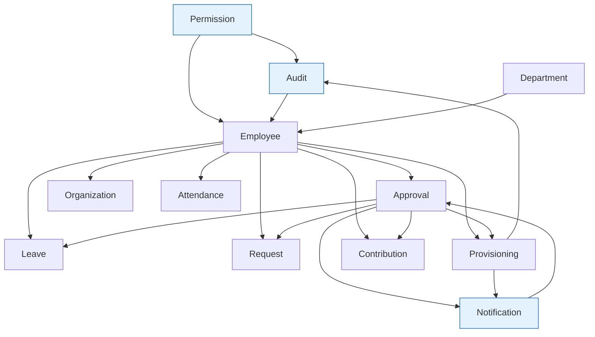

# Architecture — Module Architecture

> Cách 12 module tổ chức & phụ thuộc nhau. Module list & thứ tự nạp:
> [config/modules.php](../../config/modules.php).

## Bản đồ module & phụ thuộc



Thứ tự nạp (quan trọng — dependency trước): **Permission → Audit → Notification → Department →
Employee → Organization → Approval → Request → Attendance → Leave → Provisioning → Contribution**.

## Cấu trúc nội tại 1 module (chuẩn)
```txt
modules/<Module>/
  <Module>ServiceProvider.php   # nạp routes với prefix api/v1/... + middleware
  routes/api.php                # định nghĩa endpoint (path tương đối)
  Controllers/                  # mỏng — validate, gọi Action/Service, trả ApiResponse
  Services/                     # business logic (DB::transaction, rule)
  Models/                       # Eloquent (BaseModel, casts, relationships, Auditable)
  Repositories/ (+Contracts/)   # data access; bind qua RepositoryServiceProvider  [một số module]
  Actions/                      # 1 thao tác đơn (__invoke)                          [một số module]
  Engine/                       # lõi nghiệp vụ phức tạp (Approval, Provisioning, Contribution)
  Graph/                        # Organization: builder + traverser
  Events/ Listeners/            # giao tiếp chéo module
  Policies/ Requests/ Resources/ DTOs/   [một số module]
```

> Không phải module nào cũng đủ mọi thư mục. Vd `Notification` không có Repository; `Approval`/
> `Provisioning`/`Contribution` có `Engine/`; `Organization` có `Graph/`.

## Quy tắc giao tiếp giữa các module
1. **Ưu tiên Domain Events** — ví dụ `EmployeeCreated → TriggerProvisioningOnCreate`,
   `ApprovalWorkflowCompleted → ExecuteProvisioningOnApproval`. Bảng wiring đầy đủ:
   [EventServiceProvider](../../app/Providers/EventServiceProvider.php).
2. **Ngoại lệ có chủ đích:** `ApprovalEngine` (module Approval) được Leave/Request inject trực tiếp
   để khởi tạo workflow; `NotificationService`/`AuditService` được Engine gọi trực tiếp.
3. **Shared kernel** (`app/`) chứa thứ dùng chung: enum, BaseModel, ApiResponse, middleware,
   StateMachine.

## Map module → API → DB → Flow → Wireframe
Mỗi [docs/modules/*.md](../modules/) có bảng liên kết chéo tới API endpoints, bảng dữ liệu, business
flow và wireframe tương ứng.
