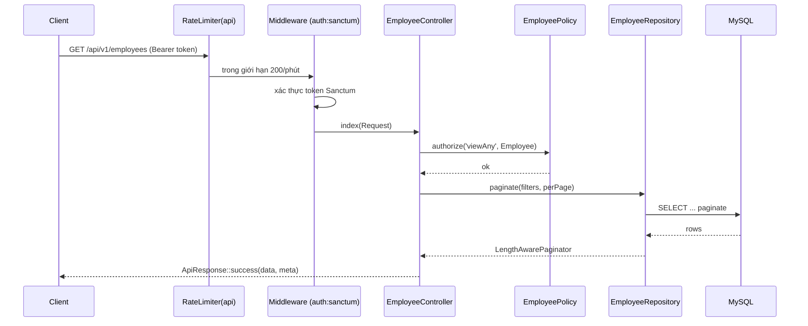
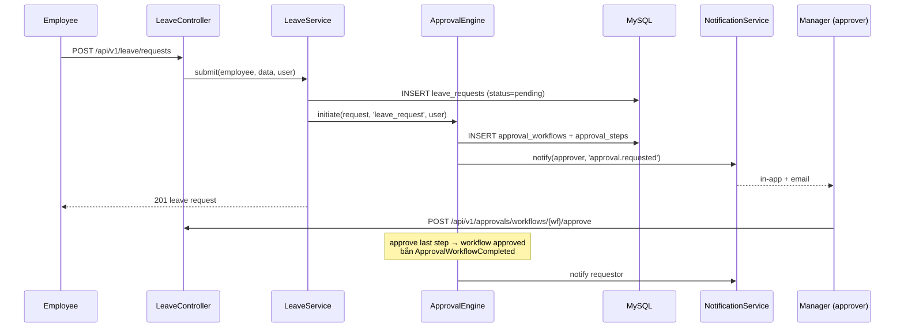

# Architecture — Request Flow

> Vòng đời một HTTP request và một luồng phê duyệt. Đối chiếu code thật.

## 1. Vòng đời HTTP request (đọc danh sách Employee)



Envelope trả về (từ [ApiResponse](../../app/Support/ApiResponse.php)):
```json
{ "success": true, "data": [ ... ], "meta": { "current_page":1, "per_page":15, "total":120, "last_page":8 } }
```

## 2. Luồng tạo + phê duyệt (submit đơn nghỉ)



## 3. Cross-module events (sau khi workflow approved)
`ApprovalWorkflowCompleted` → các listener (qua queue):
`ExecuteProvisioningOnApproval`, `UpdateRequestStatusListener`, `NotifyRequestorListener`
(xem [EventServiceProvider](../../app/Providers/EventServiceProvider.php)).

Chi tiết workflow engine: [workflow-engine.md](workflow-engine.md). Flow nghiệp vụ đầy đủ:
[docs/flows/](../flows/leave-approval-flow.md).
