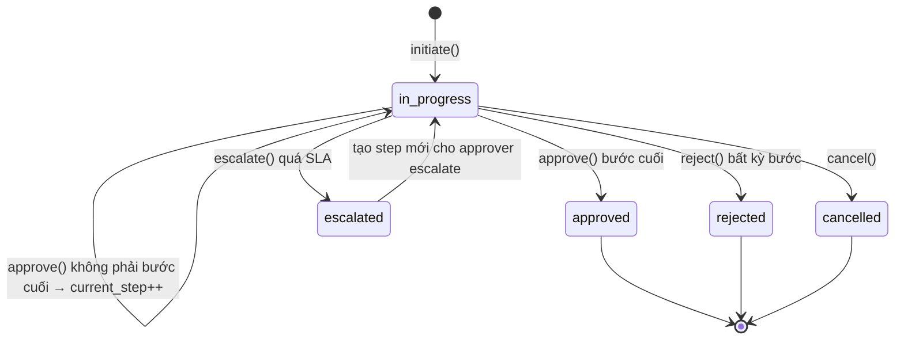

# Architecture — Workflow / Approval Engine

> Lõi phê duyệt dùng chung cho **mọi** loại yêu cầu. Nguồn:
> [ApprovalEngine](../../modules/Approval/Engine/ApprovalEngine.php),
> [EscalationHandler](../../modules/Approval/Engine/EscalationHandler.php),
> [config/workflow.php](../../config/workflow.php). Module: [docs/modules/approval.md](../modules/approval.md).

## Thành phần
| Class | Vai trò | Trạng thái |
|---|---|---|
| `ApprovalEngine` | initiate / approve / reject / delegate / cancel | ✅ hiện thực |
| `ApprovalChainResolver` | sinh chuỗi step từ `WorkflowConfiguration` | ✅ (dùng trong initiate) |
| `SlaTracker` | set `sla_deadline_at` cho workflow/step | ✅ (gọi trong initiate) |
| `DelegationResolver` | xử lý uỷ quyền step | ✅ |
| `EscalationHandler` | tạo step mới cho người escalate (role) | ✅ |

## Máy trạng thái workflow

Enum: [WorkflowStatus](../../app/Enums/WorkflowStatus.php) (pending, in_progress, approved, rejected,
cancelled, escalated) · [StepStatus](../../app/Enums/StepStatus.php) (pending, approved, rejected,
skipped, delegated, escalated).

## initiate()
1. Lấy `WorkflowConfiguration::getActiveConfig(type)` — thiếu → `WORKFLOW_CONFIG_MISSING`.
2. `ChainResolver` sinh `chain[]` — rỗng → `WORKFLOW_EMPTY_CHAIN`.
3. Trong transaction: tạo `approval_workflows` (status in_progress, total_steps=count(chain)),
   tạo `approval_steps`, set SLA, thông báo approver bước 1.

## approve() / reject()
- `approve(step, approver, notes)`: authorize → cập nhật step `approved` + tạo `approval_decisions`
  → bắn `ApprovalStepCompleted` → nếu bước cuối: `completeWorkflow()` (status approved + bắn
  `ApprovalWorkflowCompleted`); ngược lại `advanceToNextStep()`.
- `reject(step, approver, reason)`: step `rejected` + decision → workflow `rejected` + bắn
  `ApprovalRejected`.
- Authorize: chỉ `approver_id` của step hoặc người có delegation `approval.approve`.

## SLA & Escalation
- `default_sla_hours = 24`. Escalation bật, kiểm mỗi 60 phút, đích mặc định role `HR Director`.
- `EscalationHandler::escalate(step)` đánh dấu step `escalated`, tạo step mới cho user thuộc role
  escalate, bắn `ApprovalEscalated`.
- Cron `EscalateOverdueApprovals` quét step quá hạn (`sla_deadline_at < now`).

## Cấu hình workflow
`workflow_configurations.config` (JSON) chứa `steps[]` và `escalation`. 12 `workflow_type` hợp lệ
liệt kê trong [config/workflow.php](../../config/workflow.php). CRUD qua
`WorkflowConfigurationController` (permission `approval.workflow.configure`).
