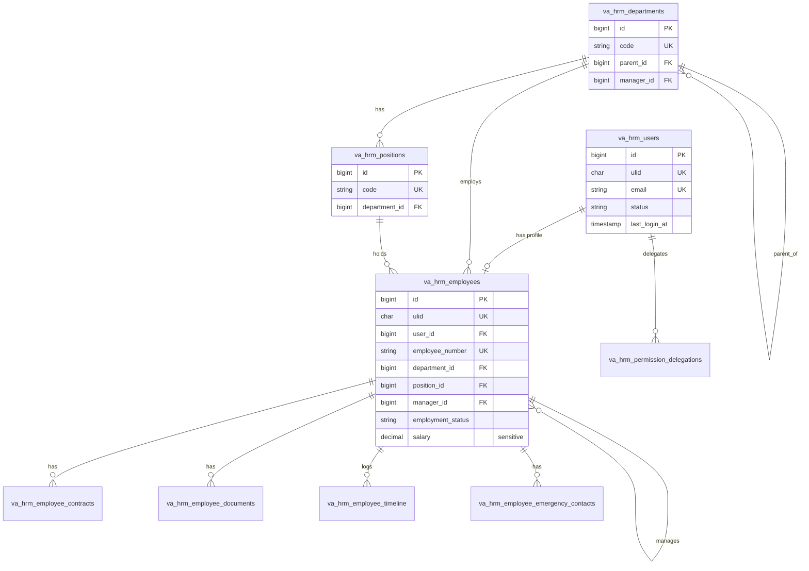
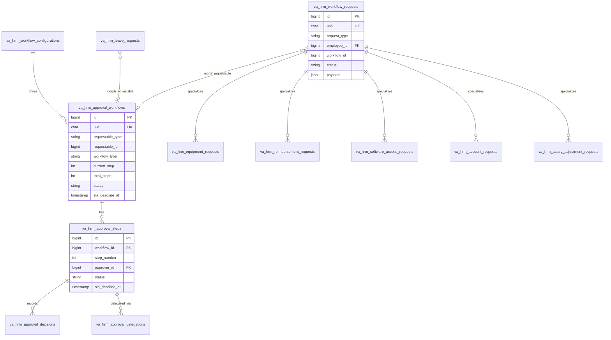
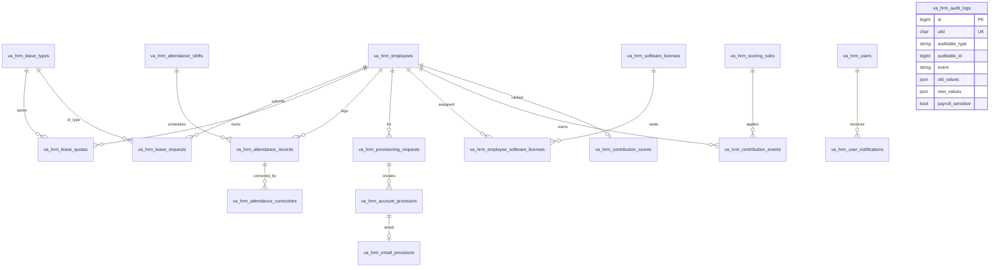

# Database — ERD (Entity Relationship Diagram)

> Nguồn: [database/migrations/](../../database/migrations/) (schema chính thức) đối chiếu
> [data-structures/](../../data-structures/) (DDL thiết kế). Chi tiết từng cột:
> [table-dictionary.md](table-dictionary.md).

Database: **MySQL 8**. Quy ước chung:
- Tên bảng vật lý: tiền tố `va_hrm_` (Laravel connection prefix — [config/database.php](../../config/database.php)); migration khai báo tên logic.
- `id` BIGINT auto-increment là khoá chính nội bộ.
- `ulid` CHAR(26) UNIQUE cho entity public-facing (route key là `ulid` qua trait
  [HasUlid](../../app/Concerns/HasUlid.php)).
- `created_at/updated_at`; `deleted_at` (soft delete) cho entity chính.
- `created_by/updated_by` cho entity cần truy vết nguồn.
- JSON column cho metadata linh hoạt.

---

## 1. Tổng quan miền dữ liệu

```mermaid
flowchart TB
    subgraph Identity & RBAC
      va_hrm_users
      va_hrm_roles
      va_hrm_permissions
      va_hrm_permission_delegations
    end
    subgraph HR Core
      va_hrm_departments
      va_hrm_positions
      va_hrm_employees
      va_hrm_employee_contracts
    end
    subgraph Organization
      va_hrm_organization_nodes
      va_hrm_organization_relationships
    end
    subgraph Workflow
      va_hrm_workflow_configurations
      va_hrm_approval_workflows
      va_hrm_approval_steps
      va_hrm_workflow_requests
    end
    subgraph Self-service
      va_hrm_leave_requests
      va_hrm_attendance_records
    end
    subgraph Ops
      va_hrm_provisioning_requests
      va_hrm_contribution_scores
      va_hrm_audit_logs
      va_hrm_user_notifications
    end

    va_hrm_users --> va_hrm_employees
    va_hrm_departments --> va_hrm_employees
    va_hrm_positions --> va_hrm_employees
    va_hrm_employees --> va_hrm_employees
    va_hrm_employees --> va_hrm_leave_requests
    va_hrm_employees --> va_hrm_attendance_records
    va_hrm_employees --> va_hrm_workflow_requests
    va_hrm_employees --> va_hrm_provisioning_requests
    va_hrm_employees --> va_hrm_contribution_scores
    va_hrm_workflow_configurations --> va_hrm_approval_workflows
    va_hrm_approval_workflows --> va_hrm_approval_steps
    va_hrm_leave_requests -.morph.-> va_hrm_approval_workflows
    va_hrm_workflow_requests -.morph.-> va_hrm_approval_workflows
    va_hrm_employees --> va_hrm_organization_nodes
    va_hrm_departments --> va_hrm_organization_nodes
    va_hrm_organization_nodes --> va_hrm_organization_relationships
```

---

## 2. ERD chi tiết — HR Core + Identity

---

## 3. ERD chi tiết — Workflow & Requests

`va_hrm_approval_workflows` gắn polymorphic vào bất kỳ "requestable" nào (va_hrm_leave_requests,
va_hrm_workflow_requests, va_hrm_attendance_corrections, va_hrm_score_adjustment_requests…) qua
`requestable_type` + `requestable_id`.

---

## 4. ERD chi tiết — Self-service, Provisioning, Contribution, Audit

> `va_hrm_audit_logs` là **polymorphic & bất biến** (chỉ có `created_at`, không update). Bản sao schema
> `va_hrm_audit_logs_archive` dùng để archive theo cron (xem [config/audit.php](../../config/audit.php)).

---

## 5. Quan hệ chéo quan trọng (không phải FK cứng)
- `va_hrm_approval_workflows.requestable_*` → polymorphic tới `va_hrm_leave_requests` / `va_hrm_workflow_requests` /
  `va_hrm_attendance_corrections` / `va_hrm_score_adjustment_requests`. Các bảng request giữ `workflow_id`
  (nullable, không FK cứng) trỏ ngược lại.
- `va_hrm_organization_nodes.reference_type/reference_id` → polymorphic tới `va_hrm_employees` hoặc `va_hrm_departments`.
- `va_hrm_audit_logs.auditable_type/auditable_id` → polymorphic tới mọi model `implements Auditable`.
- `va_hrm_audit_logs.context->workflow_id` (JSON) dùng để truy vết theo workflow.

Xem mapping Module ⇄ Bảng ⇄ API tại từng file trong [docs/modules/](../modules/).
