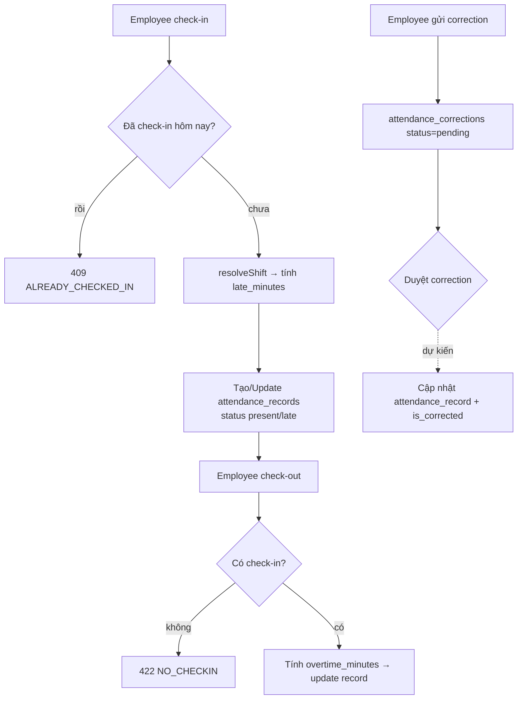

# Flow — Attendance (Check-in/out & Correction)

> Nguồn: [AttendanceService](../../modules/Attendance/Services/AttendanceService.php),
> [CheckInAction](../../modules/Attendance/Actions/CheckInAction.php). API: [api/attendance.md](../api/attendance.md).

## Business Flow

## Detailed Steps
1. `POST /api/v1/attendance/check-in` → kiểm tra trùng ngày, resolve shift, tính `late_minutes` =
   max(0, trễ − grace), set status, tạo/cập nhật record (`unique(employee_id,date)`).
2. `POST /api/v1/attendance/check-out` → tính `overtime_minutes` = max(0, checkout − shift end).
3. `POST /api/v1/attendance/corrections` → tạo correction `pending` với `proposed_values`.

## Exception Cases
- Check-in 2 lần → `ATTENDANCE_ALREADY_CHECKED_IN` (409).
- Check-out khi chưa check-in → `ATTENDANCE_NO_CHECKIN` (422).
- Không có employee profile → 422.

## Approval Logic
Correction tạo ở `pending`. **Luồng duyệt correction → cập nhật record chưa được nối Approval engine
(`workflow_id` nullable)** — **TODO: Need Human Validation**.

## Notification Logic
TODO: Need Human Validation — chưa thấy thông báo gắn trực tiếp cho check-in/out/correction.
