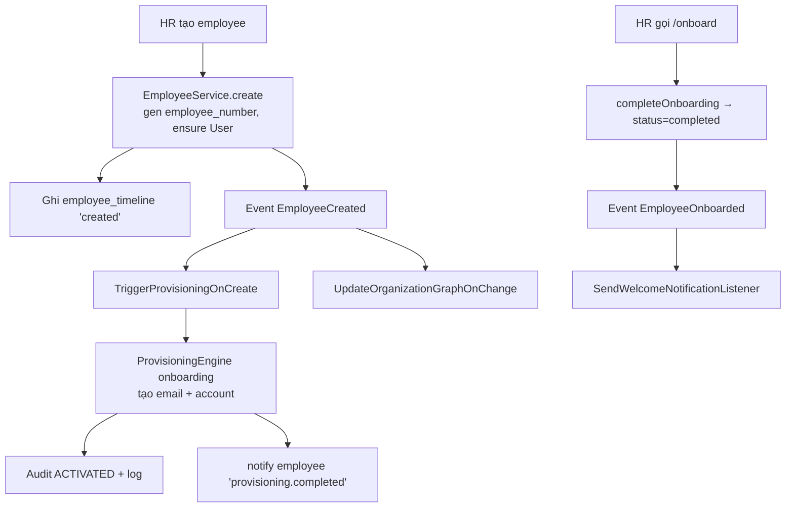

# Flow — Employee Onboarding

> Nguồn: [EmployeeService](../../modules/Employee/Services/EmployeeService.php),
> [EventServiceProvider](../../app/Providers/EventServiceProvider.php),
> [ProvisioningEngine](../../modules/Provisioning/Engine/ProvisioningEngine.php).

## Business Flow

## Detailed Steps
1. `POST /api/v1/employees` → tạo hồ sơ (pending onboarding), ghi timeline, bắn `EmployeeCreated`.
2. Listener `TriggerProvisioningOnCreate` → `ProvisioningEngine::execute(onboarding)`: tạo email +
   account, ghi `provisioning_logs`, audit `ACTIVATED`, thông báo nhân viên.
3. `UpdateOrganizationGraphOnChange` → cập nhật node/edge trong organization graph.
4. `POST /api/v1/employees/{e}/onboard` → `completeOnboarding` (status=completed) → bắn
   `EmployeeOnboarded` → `SendWelcomeNotificationListener`.

## Exception Cases
- Email trùng / thiếu department/position hợp lệ → 422 (validation).
- Provider provisioning thật chưa tích hợp → bước cấp phát là mô phỏng (**TODO: Need Human Validation**).

## Approval Logic
Onboarding mặc định không qua approval (trực tiếp). Có thể cấu hình workflow
`account_provisioning_request` nếu cần duyệt.

## Notification Logic
`provisioning.completed` (sau cấp phát), `employee.welcome` (khi onboarded).
