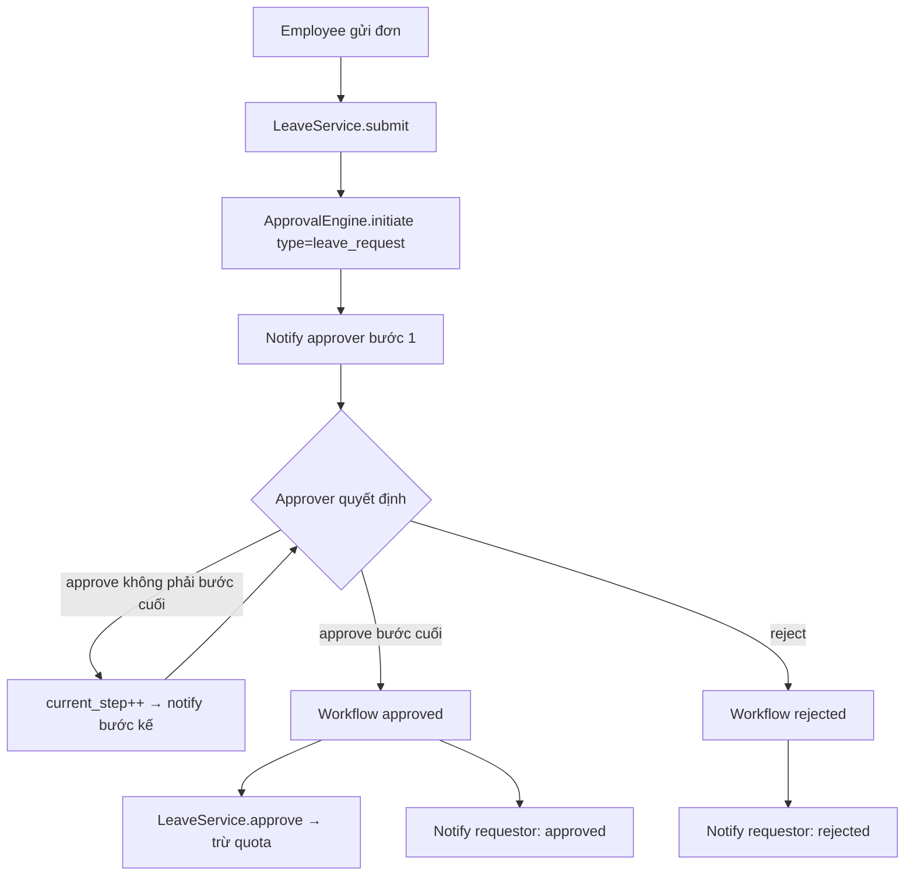

# Flow: Leave Approval (Xin nghỉ → Duyệt)

Module: [leave](../modules/leave.md) + [approval](../modules/approval.md). Code:
[LeaveService](../../modules/Leave/Services/LeaveService.php),
[ApprovalEngine](../../modules/Approval/Engine/ApprovalEngine.php).

## Business Flow

## Detailed Steps
1. **Submit** — `POST /api/v1/leave/requests`. Validate `end_date >= start_date`
   (sai → 422 `LEAVE_DATE_INVALID`). Tính `days_count = diff + 1`. Tạo `leave_requests` (pending).
2. **Initiate workflow** — `ApprovalEngine.initiate(request,'leave_request',user)` tạo
   `approval_workflows` + `approval_steps` từ `WorkflowConfiguration`, set SLA, notify approver bước 1.
3. **Approve/Reject** — approver gọi `POST /api/v1/approvals/workflows/{wf}/approve|reject`.
   Engine cập nhật step + ghi `approval_decisions`.
4. **Hoàn tất** — bước cuối approve → workflow `approved` → event `ApprovalWorkflowCompleted` →
   listener cập nhật trạng thái + (qua LeaveService.approve) **trừ quota**.
5. **Huỷ** — `DELETE /leave/requests/{id}`: nếu đơn đã approved thì **hoàn quota**.

## Exception Cases
- Không có `WorkflowConfiguration` active cho `leave_request` → 422 `WORKFLOW_CONFIG_MISSING`.
- Chuỗi bước rỗng → 422 `WORKFLOW_EMPTY_CHAIN`.
- Người không phải approver bấm duyệt → 403 `WORKFLOW_PERMISSION_DENIED`.
- Quá SLA → escalation (xem dưới).

## Approval Logic
- Nhiều cấp tuần tự; reject bất kỳ bước → cả workflow rejected ngay.
- SLA mặc định 24h/bước; quá hạn → `EscalationHandler` tạo step cho `HR Director` (mặc định).
- Delegation: approver có thể uỷ quyền step cho người khác.

## Notification Logic
- `approval.requested` → approver mỗi khi tới lượt (in_app + email).
- `approval.completed` / `approval.rejected` → người gửi khi kết thúc.
Template: [TemplateRegistry](../../modules/Notification/Templates/TemplateRegistry.php).

## Liên kết chéo
API: [leave](../api/leave.md), [approvals](../api/approvals.md) · Engine: [workflow-engine](../architecture/workflow-engine.md)
· DB: [leave_requests](../database/table-dictionary.md#leave_requests).
