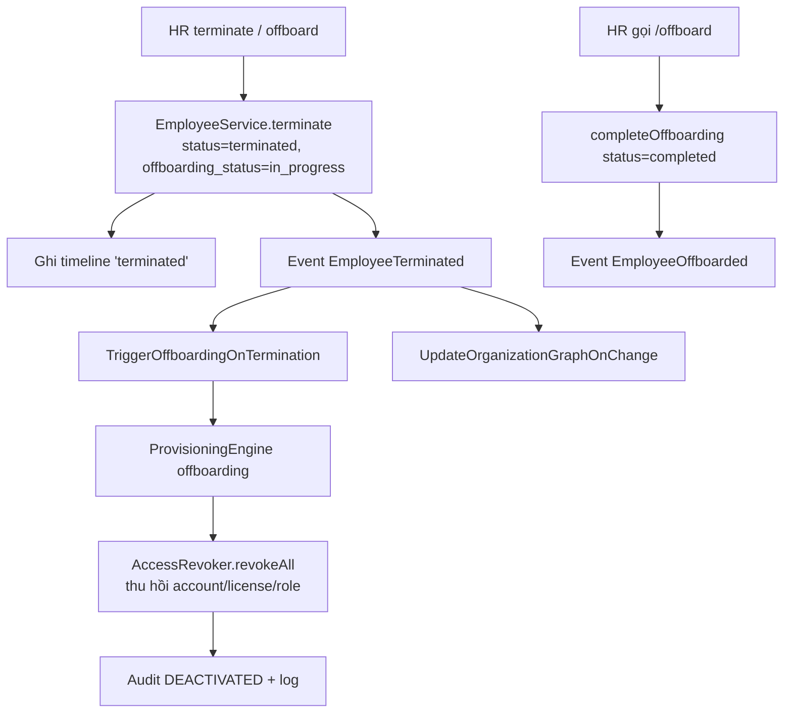

# Flow — Offboarding & Provisioning Revoke

> Nguồn: [EmployeeService::terminate](../../modules/Employee/Services/EmployeeService.php),
> [ProvisioningEngine](../../modules/Provisioning/Engine/ProvisioningEngine.php),
> [config/provisioning.php](../../config/provisioning.php).

## Business Flow

## Detailed Steps
1. `POST /api/v1/employees/{e}/terminate` `{reason, effective_date?}` → set trạng thái, timeline,
   bắn `EmployeeTerminated`.
2. `TriggerOffboardingOnTermination` → `ProvisioningEngine::execute(offboarding)` → `revokeAll`:
   thu hồi license (decrement seat), role, account; audit `DEACTIVATED`, ghi `provisioning_logs`.
3. `POST /api/v1/provisioning/offboarding/{e}` (permission `provisioning.offboarding.execute`) có
   thể trigger trực tiếp.
4. `POST /api/v1/employees/{e}/offboard` → `completeOffboarding`.

## Exception Cases
- Không quyền `provisioning.offboarding.execute` → 403.
- Tích hợp provider thật chưa có → thu hồi là mô phỏng/log (**TODO: Need Human Validation**).

## Policy (config/provisioning.php)
- Email: suspend → disable sau **30 ngày**.
- Thu hồi license & role **ngay lập tức**.

## Notification Logic
Thông báo liên quan provisioning/offboarding tới nhân viên & IT (qua NotificationService).
