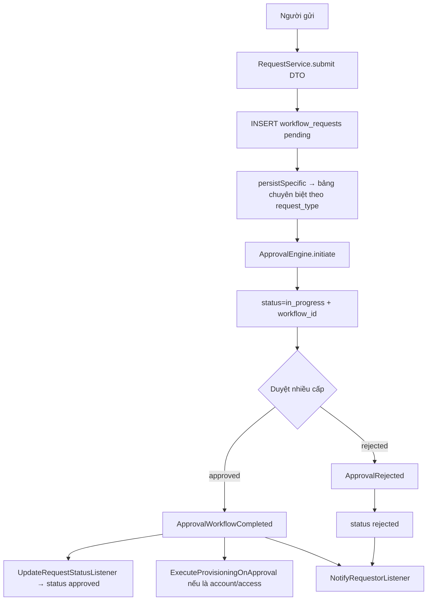

# Flow: Request Approval (Yêu cầu đa loại → Duyệt → Provisioning)

Module: [request](../modules/request.md) + [approval](../modules/approval.md) +
[provisioning](../modules/provisioning.md). Code:
[RequestService](../../modules/Request/Services/RequestService.php).

## Business Flow

## Detailed Steps
1. `POST /api/v1/requests` với `request_type` (∈ allowed_workflow_types), `employee_id`, `payload`.
2. Tạo `workflow_requests` (pending) → `persistSpecific()` map `payload` sang bảng chuyên biệt
   (equipment/reimbursement/software_access/account/salary_adjustment).
3. `ApprovalEngine.initiate()` → set `workflow_id`, status `in_progress`.
4. Duyệt nhiều cấp (giống [leave-approval-flow](leave-approval-flow.md)).
5. Khi `approved`: listeners cập nhật status, gửi thông báo, và **nếu liên quan tài khoản/quyền** →
   `ExecuteProvisioningOnApproval` kích hoạt provisioning.

## Exception Cases
- `request_type` ngoài `allowed_workflow_types` → 422 (validation).
- Thiếu field trong `payload` → dùng default an toàn (xem persistSpecific). TODO: Need Human
  Validation — có nên validate chặt hơn.
- Lỗi workflow: như flow leave.

## Approval Logic / Notification Logic
Giống workflow chung — xem [workflow-engine](../architecture/workflow-engine.md) và
[EventServiceProvider](../../app/Providers/EventServiceProvider.php).

## Liên kết chéo
API: [requests](../api/requests.md), [approvals](../api/approvals.md) · DB: [workflow_requests](../database/table-dictionary.md#workflow_requests).
