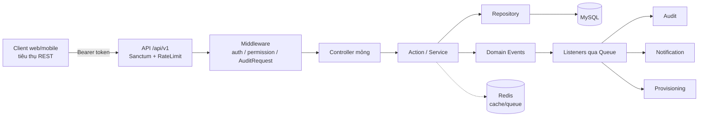

# Project Overview — VA-HRM Platform

> **Single source of truth** cho toàn bộ hệ thống. Đọc file này + [AI_CONTEXT.md](AI_CONTEXT.md)
> là đủ để nắm hệ thống trong ~30 phút. Tài liệu được suy luận trực tiếp từ source code thực tế.

---

## 1. Product Vision

### Hệ thống dùng để làm gì
VA-HRM là một **nền tảng quản trị nhân sự (HRM) cấp doanh nghiệp** cho hệ thống trường học/đơn vị
VAschools. Nó số hoá toàn bộ vòng đời nhân sự và các quy trình phê duyệt nội bộ trên một
**API backend duy nhất** (Laravel modular monolith).

### Giải quyết bài toán gì
- Quản lý hồ sơ nhân sự, hợp đồng, tài liệu, timeline sự kiện tập trung.
- Mô hình hoá **cơ cấu tổ chức** dạng đồ thị (organization graph) thay vì chỉ cây phòng ban.
- Chuẩn hoá **mọi loại yêu cầu** (nghỉ phép, thiết bị, hoàn ứng, cấp quyền phần mềm, điều chỉnh
  lương…) qua **một workflow engine phê duyệt nhiều cấp** có SLA, uỷ quyền (delegation), leo thang
  (escalation).
- Tự động **cấp phát / thu hồi tài khoản & license** khi onboarding/offboarding (provisioning).
- Ghi **audit log bất biến** cho mọi thay đổi nhạy cảm (có redaction cho dữ liệu lương/ngân hàng).
- Tính **điểm đóng góp (contribution scoring)** và xếp hạng nhân viên.
- Phân quyền **RBAC** theo vai trò + scope (organization/department/team/own) + uỷ quyền tạm thời.

### Người dùng mục tiêu (Actors)
Suy ra từ [config/permission_hrm.php](../config/permission_hrm.php):

| Role (English, dùng trong code) | Vai trò |
|---|---|
| `Super Admin` | Quản trị toàn hệ thống |
| `HR Director` | Giám đốc nhân sự — đích escalation mặc định |
| `HR Staff` | Nhân viên nhân sự — tạo/sửa hồ sơ |
| `Department Manager` | Trưởng phòng — duyệt cấp 1, xem phòng ban |
| `Team Leader` | Trưởng nhóm |
| `Employee` | Nhân viên — tự phục vụ (chấm công, xin nghỉ, gửi request) |
| `IT Support` | Hỗ trợ CNTT — provisioning |
| `Finance` | Tài chính — request hoàn ứng/lương |
| `Auditor` | Kiểm toán — chỉ đọc audit log |

---

## 2. Technical Stack

Suy ra từ [composer.json](../composer.json), [config/](../config/), [.env](../.env).

```txt
Backend:
- PHP ^8.1 (strict_types khắp nơi)
- Laravel 10 (^10.10)
- Modular Monolith (modules/ tự load qua ModuleServiceProvider)

Auth & Security:
- Laravel Sanctum 3.3   (Bearer token / personal access tokens)
- spatie/laravel-permission 6  (RBAC: roles, permissions)
- spatie/laravel-activitylog 4 (nền cho audit)

Data & Infra:
- MySQL 8 (DB_CONNECTION=mysql)
- Redis (predis) — cache / queue / session (sản xuất)
- Laravel Horizon 5 — dashboard & quản lý queue
- Queue connections: workflow=default, notifications, provisioning, audit
  (Lưu ý: .env dev đang QUEUE_CONNECTION=sync — TODO: bật redis ở staging/prod)

Mail:
- SMTP (dev: mailpit) cho EmailChannel notifications

Frontend:
- KHÔNG có SPA/React/Vue. Chỉ Blade welcome + email templates + Vite (axios) tối thiểu.
- Hệ thống là API-first; client (web/mobile) tiêu thụ REST API /api/v1.
  → Xem đặc tả UI ĐỀ XUẤT tại docs/uiux/ và docs/wireframe/ (PROPOSED).

Tooling:
- PHPUnit 10, Pint (code style), Larastan/PHPStan (static analysis)
```

> **TODO: Need Human Validation** — Một số doc cũ (đã thay thế) nhắc tới Reverb/Telescope/React/Next/
> Tailwind/S3. Hiện **không có** trong `composer.json`/`package.json`. Chỉ ghi nhận những gì có thật.

---

## 3. Folder Structure

```txt
va-hrm-2/
├── app/                  # Shared kernel (code dùng chung mọi module)
│   ├── Concerns/         #   Traits: HasUlid, HasAuditLog, HasActor
│   ├── Console/          #   Artisan commands (cron jobs) + Kernel lịch chạy
│   ├── Contracts/        #   Interfaces: Auditable
│   ├── Enums/            #   Enum tập trung: WorkflowStatus, StepStatus, AuditEvent,
│   │                     #     EmploymentStatus/Type, ProvisioningStatus, PermissionScope
│   ├── Exceptions/       #   WorkflowException, PermissionException, ProvisioningException...
│   ├── Http/             #   Controllers/Auth, Middleware (CheckPermission, AuditRequest...), Kernel
│   ├── Models/           #   BaseModel, User
│   ├── Providers/        #   ModuleServiceProvider (load modules), Event/Route/Repository/Workflow
│   └── Support/          #   ApiResponse (envelope), Helpers, Workflow/StateMachine
│
├── modules/              # 12 domain modules (mỗi module 1 bounded context)
│   └── <Module>/         #   Controllers/ Models/ Services/ routes/api.php + ServiceProvider
│                         #   (một số có Actions/ Repositories/ Engine/ Graph/ Events/ Listeners/
│                         #    Policies/ Resources/ Requests/ DTOs/)
│
├── routes/
│   ├── api.php           # Chỉ chứa auth + health; route module do từng ServiceProvider tự nạp
│   ├── web.php           # welcome
│   ├── channels.php      # broadcast channels
│   └── console.php
│
├── database/
│   ├── migrations/       # ~20 migration phủ toàn bộ schema (xem docs/database/)
│   ├── seeders/          # Role/Permission/Department/LeaveType/ScoringRule/WorkflowConfig/Admin
│   └── factories/
│
├── config/              # workflow, modules, contribution, provisioning, permission_hrm, audit...
├── data-structures/     # Data dictionary DDL (53 bảng .sql) — tham chiếu thiết kế schema
├── resources/           # welcome.blade.php, email templates, app.css/js (KHÔNG phải SPA)
├── tests/               # PHPUnit
└── docs/                # ← Tài liệu này (single source of truth)
```

### Mỗi thư mục có nhiệm vụ gì
- **`app/`** = *shared kernel*. Không chứa domain logic của một module cụ thể; chứa thứ mọi module
  dùng chung (enum, base model, response envelope, workflow state machine, middleware).
- **`modules/`** = nơi chứa nghiệp vụ. Mỗi module độc lập, đăng ký qua
  [config/modules.php](../config/modules.php) theo thứ tự phụ thuộc (Permission, Audit, Notification
  trước; Contribution sau cùng).
- **`routes/api.php`** chỉ khai báo auth + health; **route của module do chính ServiceProvider của
  module đó nạp** với prefix `api/v1/...` riêng → xem [docs/api/README.md](api/README.md).
- **`database/migrations/`** là nguồn schema chính thức → xem [docs/database/](database/).
- **`data-structures/`** là bản thiết kế DDL chi tiết (53 bảng) song song với migration.
- **`config/`** chứa tham số nghiệp vụ quan trọng (SLA, escalation, trọng số scoring, retention audit).

---

## 4. Kiến trúc tổng quan (1 phút)



Layering bắt buộc: **Controller → Action/Service → Repository → Model**. Giao tiếp **giữa các module
chỉ qua Domain Events** (xem [EventServiceProvider](../app/Providers/EventServiceProvider.php)),
không inject service chéo module (ngoại lệ: `ApprovalEngine` được Leave/Request dùng trực tiếp).

---

## 5. 12 Core Modules (xem chi tiết tại [docs/modules/](modules/))

| Module | Mục đích ngắn | Doc |
|---|---|---|
| Permission | RBAC, role, delegation | [permission.md](modules/permission.md) |
| Audit | Audit log bất biến + diff + archive | [audit.md](modules/audit.md) |
| Notification | Thông báo in-app / email | [notification.md](modules/notification.md) |
| Department | Phòng ban (cây) + vị trí (position) | [department.md](modules/department.md) |
| Employee | Hồ sơ nhân sự, hợp đồng, timeline, onboarding/offboarding | [employee.md](modules/employee.md) |
| Organization | Đồ thị tổ chức (nodes + relationships) | [organization.md](modules/organization.md) |
| Approval | Workflow engine phê duyệt nhiều cấp (SLA, delegation, escalation) | [approval.md](modules/approval.md) |
| Request | Engine yêu cầu đa loại (polymorphic) | [request.md](modules/request.md) |
| Attendance | Chấm công, ca, correction | [attendance.md](modules/attendance.md) |
| Leave | Loại phép, quota, đơn nghỉ | [leave.md](modules/leave.md) |
| Provisioning | Cấp/thu hồi tài khoản, email, license | [provisioning.md](modules/provisioning.md) |
| Contribution | Điểm đóng góp & xếp hạng | [contribution.md](modules/contribution.md) |

---

## 6. Bắt đầu nhanh
- Người mới: [docs/README.md](README.md) → file này → [AI_CONTEXT.md](AI_CONTEXT.md).
- Developer: [docs/developer-guide/getting-started.md](developer-guide/getting-started.md).
- Hiểu API: [docs/api/README.md](api/README.md).
- Hiểu dữ liệu: [docs/database/erd.md](database/erd.md).
